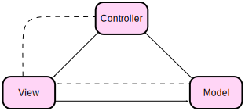

#MVC-kursen

#Beskrivning av repot

Detta repository innehåller övningar, uppgifter och projekt för kursen Objektorienterade webbteknologier (mvc) som 
fokuserar på att bygga webbapplikationer med hjälp av Model-View-Controller (MVC) designmönstret med hjälp av ramverket
Symfony. Repot innehåller bland annt modeller, kontrollers och vyer, hantering av sessioner och routers, och implementering
av applikationslogik som till exemple i form av Blackjack spelet.

#För att klona repot:

git clone https://github.com/mita2323/mvc-2025

#Installation.

1. composer install

2 .npm install

3. npm run build

4. symfony server:start

5. http://127.0.0.1:8000

#Scrutinizer badges:

